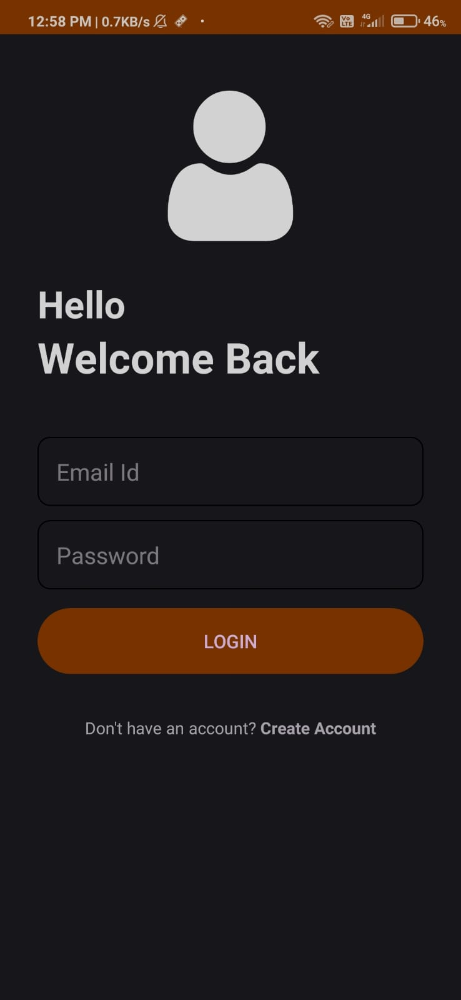

# 📓 Notes App

**Notes** is your ultimate solution for managing essential information and notes. Whether you're a student, a professional, or someone who loves staying organized, this app makes it easy to capture, organize, and access your notes effortlessly.

---

## ✨ **Features**
- 📑 Create and edit notes with ease.
- 🔒 Privacy and security with Firebase Authentication.
- 🚀 Instant note saving and retrieval using Firebase Firestore.
- 🖋️ Simple, user-friendly interface for seamless note-taking.

---

## 📱 **Technologies Used**
| Technology       | Description                                      |
|------------------|--------------------------------------------------|
| **Android Studio** | Integrated Development Environment (IDE) for Android development. |
| **Firebase**      | Used for authentication and real-time database. |
| **Java**          | Primary programming language for app logic.     |
| **Android OS**    | Platform for running the application.           |

---

## 🎨 **Screenshots**
Below are some screenshots of the app in action:

<table>
  <tr>
    <td></td>
    <td></td>
    <td></td>
  </tr>
</table>

---

## ⭐ **Support**
If you find this app helpful, please consider giving it a ⭐ on GitHub!
